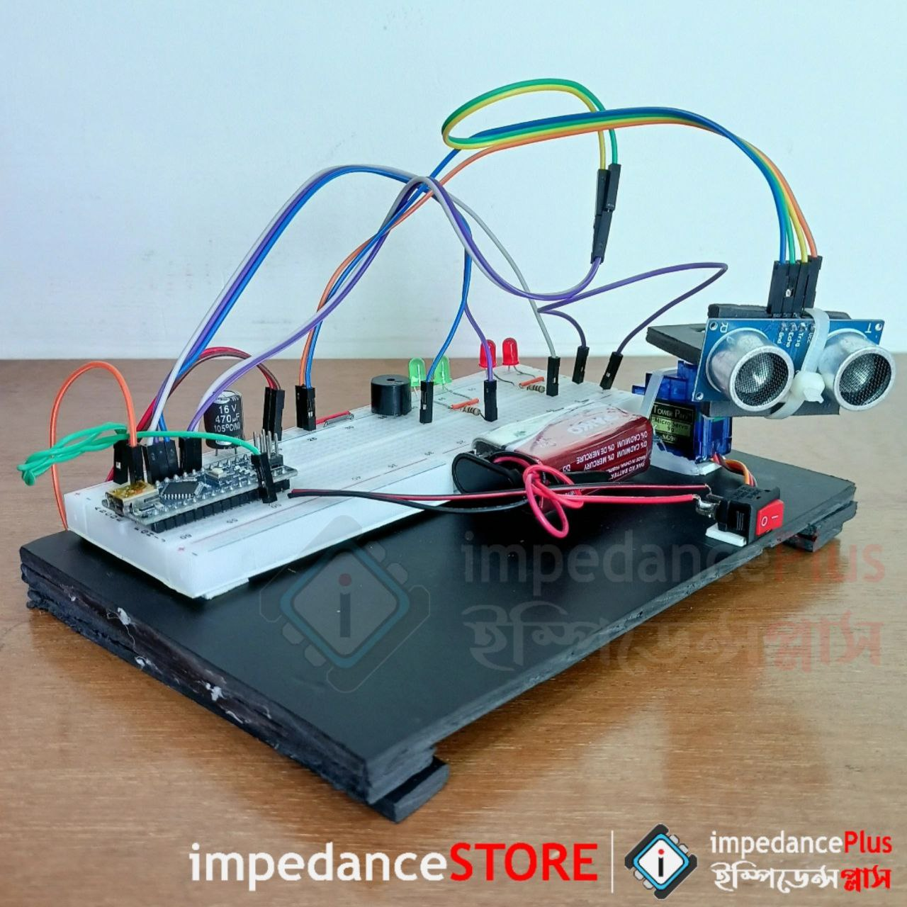
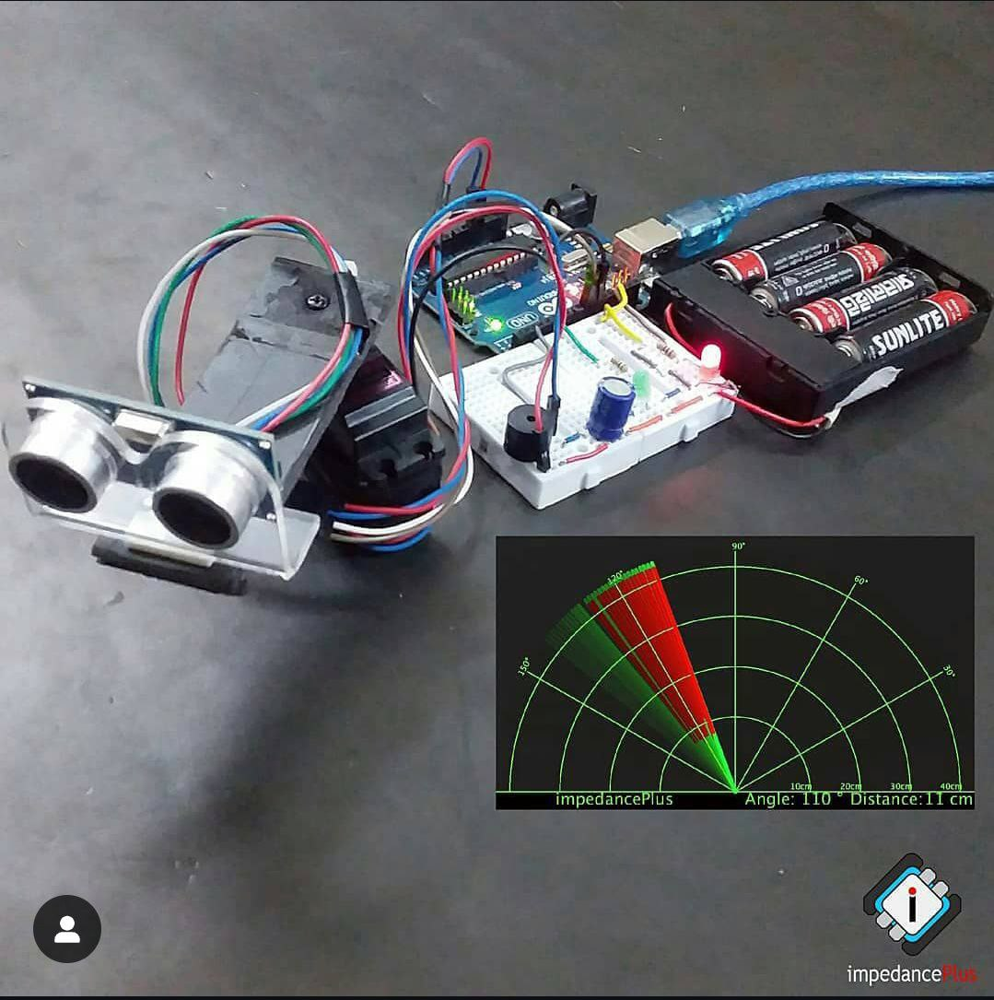
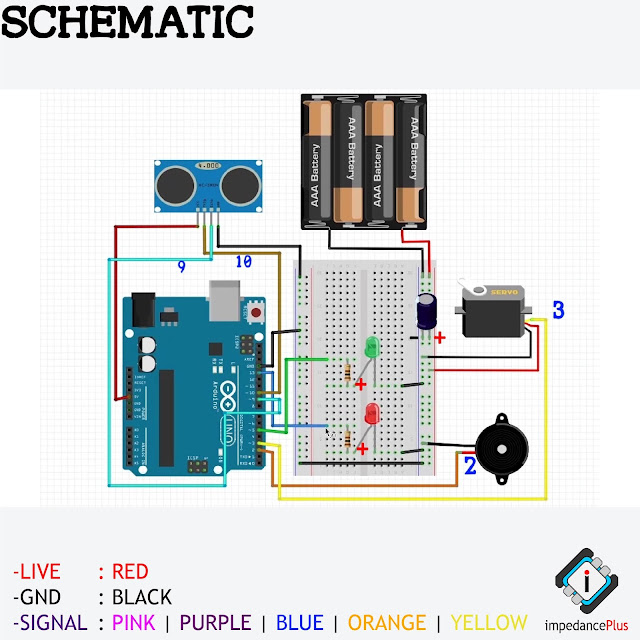

<div style="display: flex; justify-content: space-around; align-items: center;">
  
  
  
</div>

# 📜Ultrasonic Radar
The Ultrasonic Radar is an Arduino-based embedded project designed for detecting obstacles and visualizing their positions using radar-like graphics. This system utilizes ultrasonic waves to measure distances and identify objects within a specific range. The graphical representation of the radar system is powered by the Processing IDE, providing a real-time visualization of the detected objects on a screen.

This project serves as a practical application of embedded systems, combining hardware components and software programming to achieve an interactive and visually engaging output.

#### Use Case 
- Object Detection and Range Measurement
#### Project Status
- Current Version: V1.0

## ✨Features
- Obstacle detection within a defined range
- Visualizes radar graphics using Processing IDE
- Arduino-based, portable design

## 🔍Demo
<a href="https://www.youtube.com/watch?v=YourVideoLink" target="_blank">
  
</a>

## 🚀Getting Started
- Knowledge Required : C/C++, sensors, servo motors, basic circuit design

## 🛠️Hardware Requirements
- Arduino Uno
- HC-SR04 Ultrasonic Sensor
- SG90 Servo Motor
- LEDs, Buzzer
- 4x AAA Battery Pack
- Capacitors, Resistors
- Breadboard, Wires, Glue, Tape

## 💻Software Requirements
- Arduino IDE
- Processing IDE
- Servo.h Library

## 🛡️Tech Stack
- C/C++ 💻
- Arduino IDE 🧩
- Processing IDE 📊

## 🖇️Schematic


## ⚙️Installation
```
git clone https://github.com/pointer2Alvee/embd-sys-dual-axis-solar-tracker.git 
cd your-repo  
```

## 📖Usage
- Upload the Arduino sketch via Arduino IDE.
- Run the Processing IDE script for radar visualization.

## 🗺️Roadmap
- [x] Initial release with obstacle detection and visualization.
- [ ] Add Bluetooth module for remote monitoring.
- [ ] Enhance radar graphics with customizable range and angles.
- [ ] Improve energy efficiency for prolonged usage.

## 🤝Contributing
Contributions are welcomed!

+ Fork the repo. 
+ Create a branch: git checkout -b feature/YourFeature.
+ Commit changes: git commit -m 'Add some feature'.
+ Push to branch: git push origin feature/YourFeature.
+ Open a Pull Request.

## 📜License
Distributed under the MIT License. See LICENSE.txt for more information.

## 🙏Acknowledgements
- Libraries-Frameworks Used : Servo.h  
- Special thanks to the open-source community for tools and resources.

